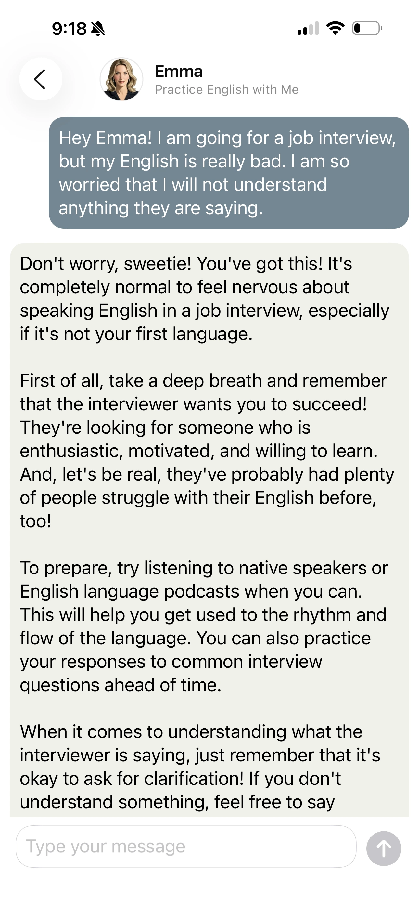
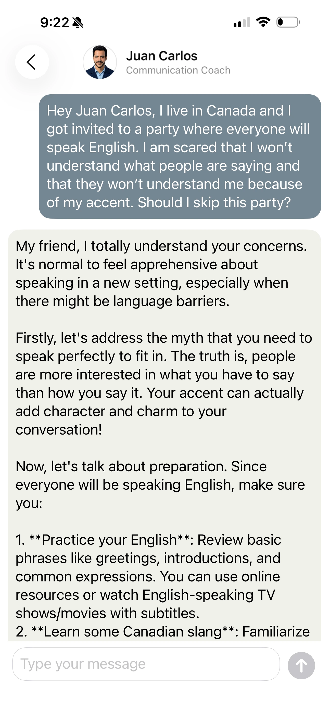

---

## Fonctionnalités clés
- **Gratuit :** Pas de frais ni de publicités.
- **Hors ligne :** Discutez sans internet après le téléchargement initial du modèle.
- **Privé :** Vos conversations restent sur votre téléphone — supprimez-les quand vous voulez. **[Politique de confidentialité](/fr/privacy-policy)**

---

  

    
  

  

    
  

  

    
  

---

Vous voulez vous confier sur le travail, partager une histoire drôle ou vous plaindre de votre patron ? Faites-le dans un espace sûr et privé où vos conversations restent sur votre téléphone — supprimez-les à tout moment, sans que les données ne soient envoyées dans le cloud. Nos personnages IA soutiennent votre progression avec des conseils calmes et pratiques pour réduire l’anxiété liée à la prise de parole et améliorer vos compétences en présentation.

Razmova fonctionne entièrement sur votre appareil pour garder vos données sécurisées et privées. Elle est conçue pour vous aider à apprendre, à mieux communiquer et à vous sentir plus confiant et heureux — que ce soit pour pratiquer une langue ou pour une conversation amicale.

---

## Avis de tiers
### Dépendances
- [mlx-swift](https://github.com/ml-explore/mlx-swift) — licence : [MIT](https://github.com/ml-explore/mlx-swift/blob/main/LICENSE)
- [mlx-libraries](https://github.com/ml-explore/mlx-swift-examples) — licence : [MIT](https://github.com/ml-explore/mlx-swift-examples/blob/main/LICENSE)
- [swift-argument-parser](https://github.com/apple/swift-argument-parser) — licence : [Apache-2.0](https://github.com/apple/swift-argument-parser/blob/main/LICENSE.txt)
- [swift-collections](https://github.com/apple/swift-collections) — licence : [Apache-2.0](https://github.com/apple/swift-collections/blob/main/LICENSE.txt)
- [swift-numerics](https://github.com/apple/swift-numerics) — licence : [Apache-2.0](https://github.com/apple/swift-numerics/blob/main/LICENSE.txt)
- [swift-transformers](https://github.com/huggingface/swift-transformers) — licence : [Apache-2.0](https://github.com/huggingface/swift-transformers/blob/main/LICENSE)

### Modèle LLM
- [Llama-3.2-3B-Instruct-4bit](https://huggingface.co/mlx-community/Llama-3.2-3B-Instruct-4bit) - [licence](https://huggingface.co/meta-llama/Llama-3.2-1B/blob/main/LICENSE.txt)

---

## Informations de contact

Pour toute question ou demande d’assistance, veuillez contacter :

**Tarnovski Consulting**  
**E-mail :** [tatiana@tarnovskiconsulting.com](mailto:tatiana@tarnovskiconsulting.com)

---

© 2025 Tarnovski Consulting. Tous droits réservés.
